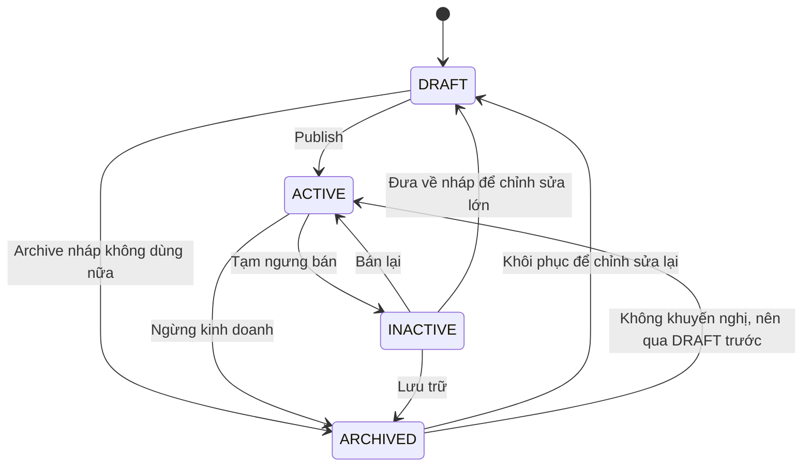

# Product Status Flow

## Mục tiêu

Tài liệu này mô tả nghiệp vụ chuyển đổi trạng thái của Product trong hệ thống ecommerce, bao gồm ý nghĩa từng status, luồng chuyển trạng thái, tác động tới storefront, API/backend, frontend admin, cache và search indexing.

## Status hiện có

Product sử dụng enum `ProductStatus` với 4 giá trị:

| Status | Ý nghĩa nghiệp vụ | Hiển thị storefront | `publishedAt` |
| --- | --- | --- | --- |
| `DRAFT` | Bản nháp, product chưa sẵn sàng bán hoặc đang nhập dữ liệu. | Không hiển thị. | `null` |
| `ACTIVE` | Product đã publish, có thể hiển thị/bán nếu visibility và inventory hợp lệ. | Có thể hiển thị. | Có timestamp publish |
| `INACTIVE` | Product tạm ngưng bán/ẩn tạm thời, có thể kích hoạt lại. | Không hiển thị. | `null` |
| `ARCHIVED` | Product ngừng kinh doanh/lưu trữ để audit, không nên dùng lại cho bán hàng. | Không hiển thị. | `null` |

## Nguyên tắc nghiệp vụ

1. Chỉ `ACTIVE` được xem là trạng thái publish.
2. Khi chuyển sang `ACTIVE`:
   - Backend set `publishedAt = Instant.now()` nếu product chưa từng có `publishedAt`.
   - Nếu product đang `ACTIVE` và đã có `publishedAt`, giữ nguyên thời điểm publish cũ.
3. Khi chuyển sang `DRAFT`, `INACTIVE`, hoặc `ARCHIVED`:
   - Backend clear `publishedAt = null`.
   - Product không được xuất hiện ở storefront public.
4. Storefront chỉ lấy product qua endpoint public đã filter `status=ACTIVE` và visibility hợp lệ.
5. Admin catalog vẫn có thể xem tất cả status để quản trị vòng đời product.

## State machine đề xuất



## Luồng thao tác admin frontend

Trang admin Product list hỗ trợ các thao tác lifecycle:

| Trạng thái hiện tại | Action chính | Status sau action |
| --- | --- | --- |
| `DRAFT` | `Chuyen ACTIVE` | `ACTIVE` |
| `ACTIVE` | `Chuyen INACTIVE` | `INACTIVE` |
| `INACTIVE` | `Chuyen ACTIVE` | `ACTIVE` |
| Bất kỳ status chưa archived | `Ve DRAFT` | `DRAFT` |
| Bất kỳ status chưa archived | `Archive` | `ARCHIVED` |
| `ARCHIVED` | Không cho action nhanh ở UI hiện tại | Giữ `ARCHIVED` |

Điều kiện quyền trên frontend:

- Cho phép đổi status nếu user có một trong các permission:
  - `PRODUCT_UPDATE`
  - `PRODUCT_MANAGE`
  - `PRODUCT_PUBLISH`

## API contract

### Endpoint

```http
PATCH /products/{id}/status
Content-Type: application/json
```

### Permission backend

```text
PRODUCT_UPDATE hoặc PRODUCT_MANAGE
```

### Request body

```json
{
  "status": "ACTIVE"
}
```

`status` phải là một trong:

```text
DRAFT, ACTIVE, INACTIVE, ARCHIVED
```

### Response

Backend trả `AdminProductDetailResponse`. Do global `ResponseHandler`, runtime JSON thường có envelope:

```json
{
  "data": {
    "id": 10,
    "code": "PHONE-01",
    "name": "Phone",
    "status": "ACTIVE",
    "publishedAt": "2026-04-26T13:58:00Z"
  }
}
```

Frontend phải unwrap `data` trước khi bind UI.

## Backend flow

Luồng xử lý chính nằm ở `ProductService.updateStatus`:

1. Validate request khác `null` và `status` khác `null`.
2. Load product theo `id`.
3. Set `product.status = request.status`.
4. Resolve `publishedAt`:
   - `ACTIVE`: giữ timestamp cũ nếu có, nếu không thì set thời điểm hiện tại.
   - Status khác `ACTIVE`: clear `publishedAt`.
5. Save product.
6. Invalidate cache product/list/detail.
7. Publish catalog event sau transaction commit với event type `catalog.product.status-changed`.
8. Search service nhận event và re-index product document.

## Frontend flow

Luồng xử lý admin UI:

1. User bấm action status trong Product list.
2. `ProductsPage` tính status tiếp theo:
   - `ACTIVE -> INACTIVE`
   - status khác `ACTIVE -> ACTIVE`
   - hoặc action riêng `DRAFT` / `ARCHIVED`.
3. Gọi `ProductApiService.updateStatus(id, status)`.
4. Service gọi `PATCH /products/{id}/status` và unwrap response envelope.
5. UI patch lại list item hiện tại:
   - `status`
   - `visibility`
   - `publishedAt`
   - `images`
   - `thumbnailUrl`
6. Nếu product đang mở trong editor, editor được sync lại từ response mới.
7. Hiển thị notification thành công/thất bại.

## Tác động storefront

Product chỉ hiển thị ngoài public khi đồng thời thỏa các điều kiện:

1. `status = ACTIVE`.
2. `visibility` là `CATALOG` hoặc `CATALOG_SEARCH`.
3. Inventory/business rule cho phép hiển thị/mua hàng nếu màn hình có kiểm tra tồn kho.

Các status `DRAFT`, `INACTIVE`, `ARCHIVED` không nên xuất hiện ở public endpoint.

## Tác động cache và search

Khi đổi status:

- Cache product list/detail cần bị invalidate để admin và storefront không nhìn thấy dữ liệu cũ.
- Catalog event `catalog.product.status-changed` cần được publish sau commit.
- Search index cần nhận trạng thái mới để:
  - Product `ACTIVE` có thể được search nếu visibility phù hợp.
  - Product không `ACTIVE` bị loại khỏi kết quả public search.

## Validation và edge cases

| Case | Hành vi mong muốn |
| --- | --- |
| Request không có body hoặc `status = null` | Backend trả lỗi invalid param. |
| Product không tồn tại | Backend trả lỗi data not found. |
| Chuyển `DRAFT -> ACTIVE` | Set `publishedAt` mới. |
| Chuyển `ACTIVE -> INACTIVE` | Clear `publishedAt`. |
| Chuyển `INACTIVE -> ACTIVE` | Set `publishedAt` mới. |
| Chuyển `ACTIVE -> ACTIVE` | Nên giữ nguyên `publishedAt`; UI hiện tại không gọi nếu status không đổi. |
| `ARCHIVED` | UI không cho action nhanh; nếu cần restore nên đi qua flow riêng có xác nhận. |

## Quyết định nghiệp vụ hiện tại

- `INACTIVE` dùng cho tạm ẩn/tạm ngưng bán, có thể bật lại nhanh.
- `DRAFT` dùng cho chỉnh sửa hoặc chuẩn bị dữ liệu trước khi publish.
- `ARCHIVED` dùng cho lưu trữ/ngừng kinh doanh; không khuyến nghị chuyển thẳng về `ACTIVE` từ UI nhanh.
- `publishedAt` không được xem là lịch sử publish vĩnh viễn; nó là thời điểm publish hiện hành. Nếu cần audit lịch sử publish/unpublish, nên bổ sung bảng audit/event riêng.

## Checklist kiểm thử

### Backend

- `DRAFT -> ACTIVE` trả response `status=ACTIVE` và `publishedAt != null`.
- `ACTIVE -> DRAFT` trả response `status=DRAFT` và `publishedAt = null`.
- `ACTIVE -> INACTIVE` trả response `status=INACTIVE` và `publishedAt = null`.
- Request thiếu status trả lỗi validation.
- Product không tồn tại trả lỗi not found.

### Frontend

- Product list hiển thị action đổi status theo status hiện tại.
- Bấm `Chuyen ACTIVE` gọi `PATCH /products/{id}/status` với body `{ "status": "ACTIVE" }`.
- Bấm `Chuyen INACTIVE` gọi body `{ "status": "INACTIVE" }`.
- Bấm `Ve DRAFT` gọi body `{ "status": "DRAFT" }`.
- Bấm `Archive` gọi body `{ "status": "ARCHIVED" }`.
- Sau response, chip status trong table đổi ngay không cần reload toàn trang.
- Nếu product đang mở editor, editor không bị lệch dữ liệu so với row.

## File triển khai liên quan

- Backend enum: `ecommerce-shop/common/src/main/java/com/ttl/common/dto/ProductStatus.java`
- Backend request: `ecommerce-shop/common/src/main/java/com/ttl/common/request/AdminProductStatusUpdateRequest.java`
- Backend controller: `ecommerce-shop/basecommerce/src/main/java/com/ttl/base/controller/ProductController.java`
- Backend service: `ecommerce-shop/basecommerce/src/main/java/com/ttl/base/service/ProductService.java`
- Frontend endpoint constants: `ecommerce-ng/src/app/core/constants/api-endpoints.ts`
- Frontend API service: `ecommerce-ng/src/app/core/services/product-api.service.ts`
- Frontend admin page: `ecommerce-ng/src/app/features/catalog/products/products.page.ts`
